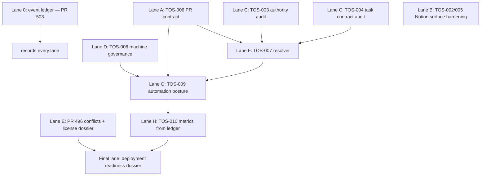

# Campaign plan — ONE-20260810-TOS (rev 2, post plan-review panel)

**Objective:** leave the Tailered OS program materially complete: authority layer live (done),
GitHub↔Notion contract enforced (TOS-006), canonical Notion surfaces delta-hardened
(TOS-002/003/004/005/008), task→context resolution working (TOS-007), lifecycle automation safe
or explicitly gated (TOS-009), measurement real (TOS-010), PR #496 license-clean and
conflict-free or owner-gated with a complete dossier, everything recorded in the event ledger.

**Normative reference:** every §N below dereferences `directive-v2.md` in this directory
(FABLE-5 MASTER DIRECTIVE v2, sha256
`d9cb6dc15be8e59da3b5554c9fbf879f150f5291be11dbb98d3223415fe3744e`). G0–G10 are its §8.
**Base:** `main` @ `5a9b657` (PR #502 merge — TOS-001 authority layer authoritative).
**Resume surface:** `node scripts/one-shot/ledger.mjs status ONE-20260810-TOS`; concepts in
`os/one-shot/README.md`; this run dir carries manifest, events, directive, and review reports.
**Ledger write rule (single-writer):** only the orchestrator session appends events, on the
ledger branch (PR #503). Lanes and subagents report facts to the orchestrator; they never
append. This is what keeps one linear hash chain honest across parallel lanes.

## Dependency graph

## Lane specs and acceptance

- **Lane A — TOS-006.** New numbered workflow (not an extension of 01-pr-proof-contract: 01
  runs on merge_group where no PR body exists, and its proof-contract.json check schema is
  frozen). Mechanism: triggers on ALL PRs with `types: [opened, edited, synchronize, reopened]`,
  computes changed paths in-job from git (offline), and exits no-op unless the PR touches the
  enumerated TOS scope set: `platform/tailered-os/**`, `config/tailered-os-control-plane*`,
  `scripts/tailered-os*`, `scripts/ci/tos-*`, `scripts/one-shot/**`, `os/one-shot/**`,
  `.github/workflows/tailered-os.yml`, plus the workflow file itself. PR body reaches the
  validator via `env:` only (never `${{ }}` inside `run:` — template-injection class). The
  validator (`scripts/ci/`) derives identifiers ONLY from `loadControlPlaneManifest()` — never a
  copied id, never `CANONICAL` — and matches Notion URLs by extracting the dash-normalized
  32-hex id, not by exact template match. When `os/one-shot/**` changed, the same job runs
  `ledger.mjs verify` over every committed run (integrity gate). Fixture bodies live as `.txt`
  (prettier-safe); secret-shaped values runtime-assembled (gitleaks-safe).
  Accept: (1) validator tests green including negative fixtures for EVERY rejection path, each
  asserting on failure-message CONTENT (names the missing field, shows a copy-pasteable
  compliant block, cites the manifest path) — not just exit codes; (2) unrelated-Dime-PR no-op
  proven by fixture; (3) the TOS-006 PR itself satisfies its own contract; (4) gstack
  review/health/cso; (5) "enforced" requires the check marked Required in branch protection —
  that flip is PREZ's and rides the Owner-Gate Queue (OG-002); until resolved the contract is
  "live but advisory," and the plan says so rather than claiming enforcement.
- **Lane B — TOS-002/005** and **Lane C — TOS-003/004** (Notion, connector live in the
  orchestrator session): audit first (running), then fix within the §18 write allowlist.
  Campaign rule (review F5): read-and-store the full pre-image into this run dir BEFORE every
  mutation; snapshot → mutate → re-read; all three ledgered. Manifest-flag semantics:
  `safety.notionWriteOperationsAuthorized:false` is the STANDING default for automated/
  ungoverned actors; this campaign's writes ride the directive's explicit bounded §18 grant.
  Encoding scoped-write semantics into the manifest is Lane G design material, not a mid-run
  flag flip.
- **Lane D — TOS-008**: reconcile the AI Systems Registry; register the execution recorder
  (this ledger) with owner/kill-path/review-cadence; Pending over false Approved.
- **Lane E — PR #496**: merge `main` INTO `chore/embed-tailered-os` (never rebase — fingerprint
  pins); re-derive the full license list from live CI; classify every flagged package
  (direct/transitive, runtime/dev/build/optional-platform, distributed?). Remediation order
  (§15): remove > replace > prove non-applicable > exact per-package exception ONLY with the
  complete dossier and zero ambiguity — and any such exception is presented to PREZ in the PR
  body + Owner-Gate Queue for ratification at merge (the merge is owner-gated regardless, so no
  posture change takes effect without PREZ). Anything ambiguous or runtime-reachable copyleft:
  OWNER-GATE, workflow untouched. Isolation re-proof, pre-merge executable: changed-path
  enumeration proving zero Dime-runtime files + local Docker build context comparison against
  main (not a post-deploy byte comparison).
- **Lane F — TOS-007**: resolver script, manifest as the only identifier root (import
  `loadControlPlaneManifest()`), versioned packet schema, fail-clear on the §16 failure modes;
  fixture tests. Live test constraint: scripts cannot use the session-bound connector — live
  equivalence is checked by the orchestrator comparing a connector fetch against the resolver's
  parse of the same record; a script-usable Notion credential is a PREZ provisioning decision
  (OG queue) and NOT required for fixture-green acceptance.
- **Lane G — TOS-009**: default outcome this run is GATED, NOT BUILT (CEO review cut). Build
  automation only if Lanes A, D, F land clean ("stable" bar: A merged or queued-required, D
  registry reconciled, F fixture-green + devex-reviewed). Whatever ships must pass the §18
  may/may-not lists and test matrix; webhooks otherwise deferred with the §18 controls recorded
  as the entry bar for the next campaign.
- **Lane H — TOS-010**: derive §45 metrics from this run's ledger; absent baselines marked
  Draft; never invented numbers.
- **Deployment**: no staging exploration while #496 is conflicting/license-red. Realistic
  terminal output this run: a deployment-readiness dossier (target platform from the actual
  `platform/tailered-os/` contract, environment progression, required-secret list for PREZ),
  not a deploy.

## Merge strategy

Bounded PRs to `main` (merge = production Railway rebuild; batch to avoid gratuitous rebuilds;
prove Dime-runtime inertness per PR via changed-path enumeration). #503 (ledger) merges first
among campaign PRs so the evidence chain lives on main, then TOS-006, then #496 when clean +
ratified. Any merge requiring human approval → Owner-Gate Queue with full evidence. Gate state
authority (review F5): the LEDGER is the source of owner-gate state; this plan is a static
expectation list; any Notion queue surface is a projection citing ledger event ids.

## Standing owner gates

- **OG-001** — agent:doctor provenance chain (PREZ, device admin).
- **OG-002** (expected) — mark the TOS-006 check Required in branch protection (PREZ).
- **OG-003** (expected) — ratify the #496 per-package license exception dossier at merge, or
  rule remove/replace instead (PREZ).
- Expected: merge approvals for #503/TOS-006/#496 if protection requires human review;
  deployment secrets provisioning; script-usable Notion credential for TOS-007 live tests.

## Non-goals

Dime product behavior changes; Dime `/ship`; security/legal exceptions; branch-protection
changes by the agent; TOS-007 inside the TOS-006 change set; new databases/queues without
earn-its-existence; ledger appends from anyone but the orchestrator.
